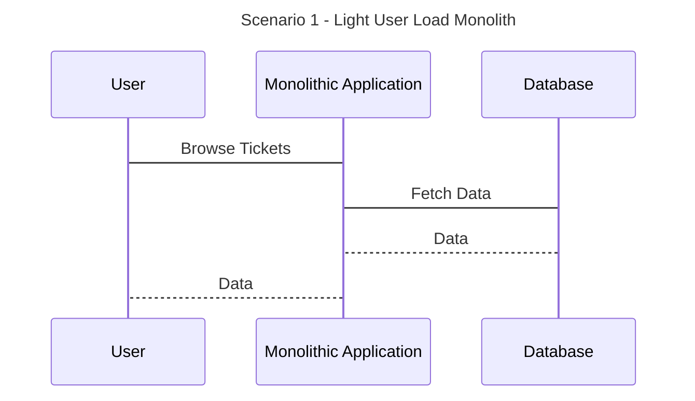
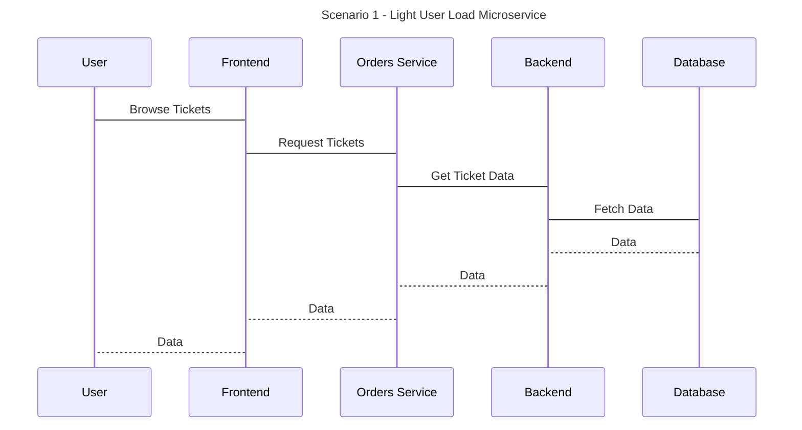
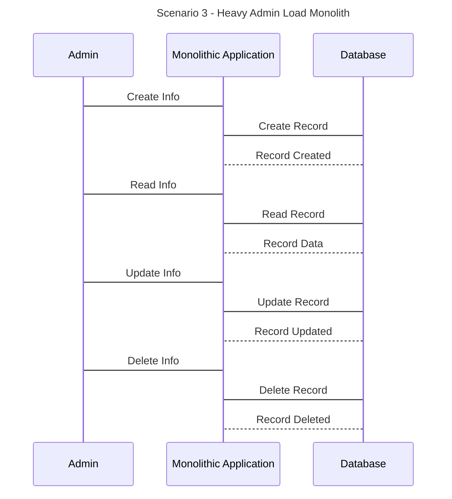
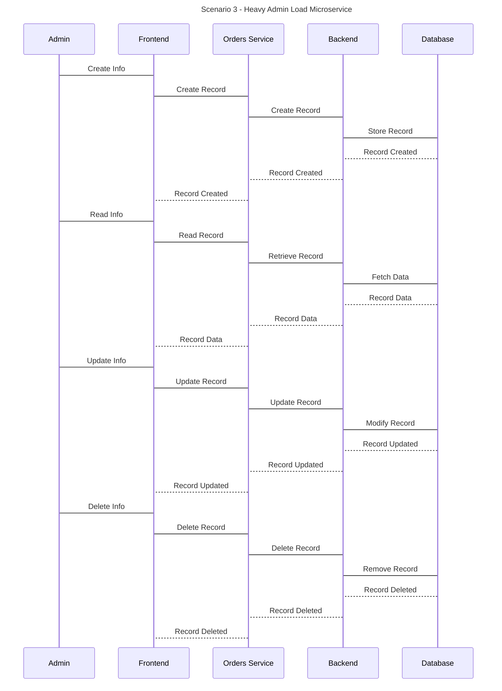
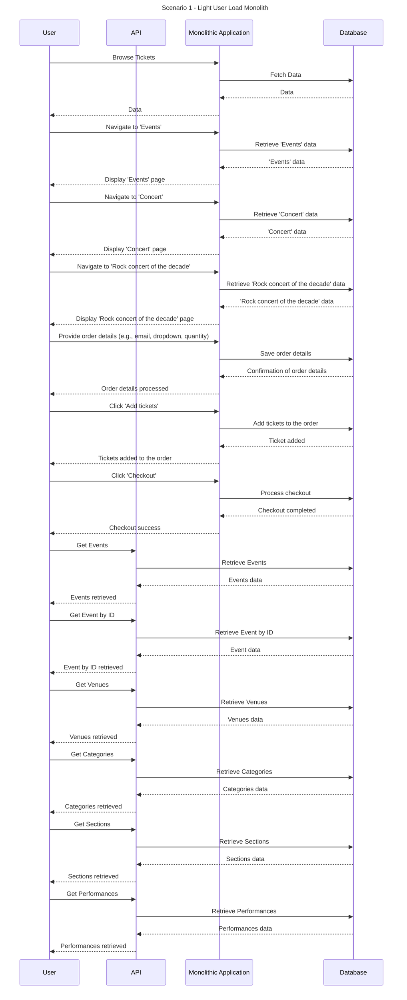
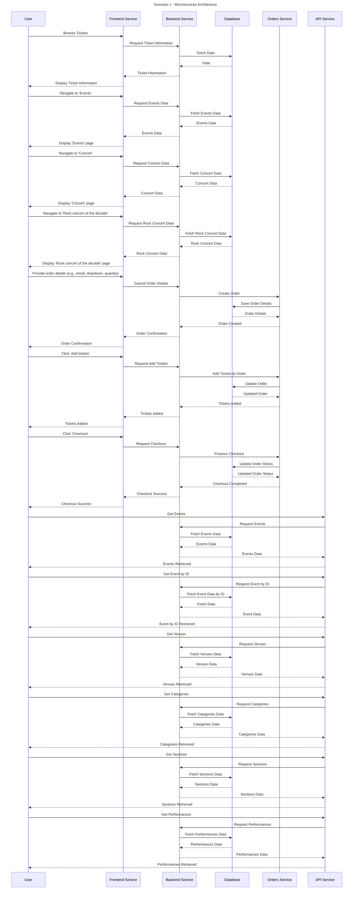
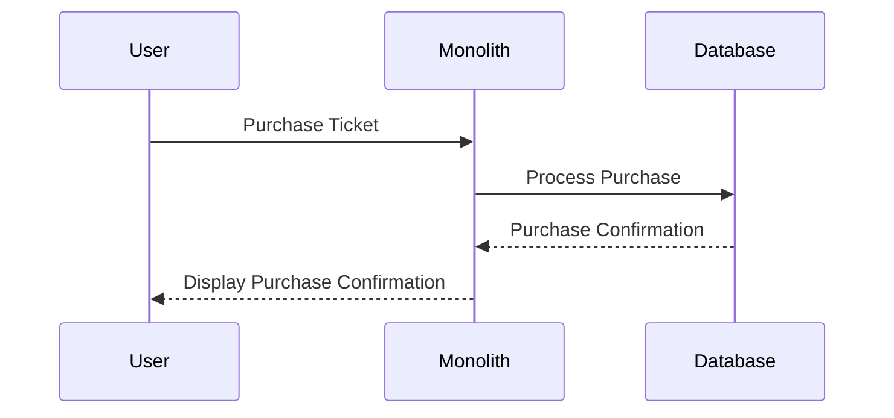
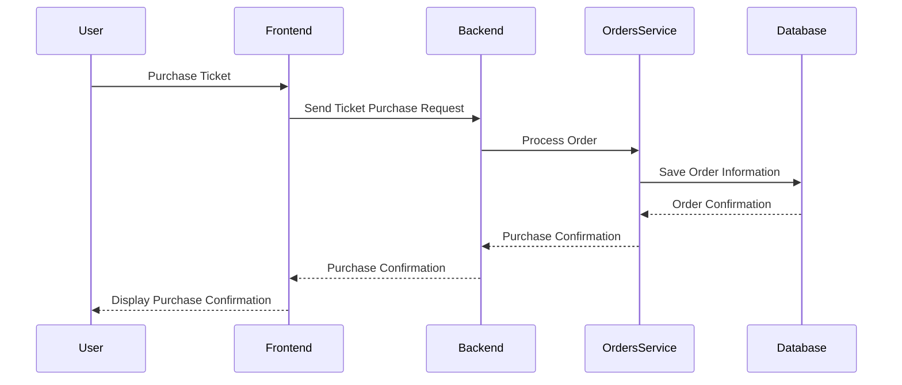

# 📈 Monolith vs. Microservices Power Consumption Comparison

This project contains an experiment built to measure the energy consumption of various architectures of an application. Multiple applications have been tested including [TicketMonster](https://github.com/ticket-monster-msa/monolith) and [PetClinic](https://github.com/spring-petclinic). The experiment expects two versions of the application (Monolith and Microservices architecutres), where a variety of workloads are executed on the application to measure the energy consumption.

## 🏗️ Project structure

The project is broken up into two parts: the monolith and the microservices. The monolith is located in the `monolith` folder, and the microservices are broken up between three folders:

- `applications` The applications used in the experiment (Are not included, need to be cloned seperately)
- `data-extaction` The scripts used to extract data after an experiemnt, preparing for data analysis
- `data-visualisation` A collection of visualised experiments, containing graphs and analysis
- `output` Where data will be stored after an experiment (May need to be created)
- `scripts` A collection of bash scripts used to run the experiment
- `selenium` The selenium scripts used to navigate the frontend of the application (One phase of the experiment)
- `workflows` The workflows used in the experiment, containing the Selenium and Newman configurations, where you give your instructions on what workloads to perform on an experiment

## 🥅 Goal

The goal of this project is to compare the energy consumption of the monolith and microservice architectures, using a collection of bash scripts that utilise [Selenium](https://www.selenium.dev/), [Docker](https://www.docker.com/), [Newman CLI](https://github.com/postmanlabs/newman) and [Powerstat](https://github.com/ColinIanKing/powerstat).


> The architecture of the experiment

## 💻 Software Prerequisites

To run this project you will need the following installed on your system:

- [Docker](https://www.docker.com/)
- [Python3](https://www.python.org/downloads/)
- jq (`sudo apt-get install jq -y`)
- [newman](https://github.com/postmanlabs/newman)
- [Powerstat](https://github.com/ColinIanKing/powerstat)
- pyyaml - `pip3 install pyyaml`

## 🏗️ Hardware Prerequisites

The experiment is designed to be run on a Linux machine, and requires the following hardware:

- A Ubuntu Server 20.04 LTS machine
- A second laptop or desktop machine
- A stable local WiFi Network

## ✅ Getting started

To run this project you will need to complete the following steps:

1. Clone this repository to your server machine
2. Clone the monolith and microservices applications to your server machine
3. Ensure all prerequisites are installed (See previous section)
4. Prepare your scripts (e.g. check `workflows/ticketmonster/scenario-1/`), there are two directories: monolith and microservice, each requiring the following files:
   - `frontend.yml` - Contains a list of instructions for Selenium to follow to navigate and execute tasks on the frontend, you can test this by directly executing these files with the `selenium/web_crawler.py` script
   ```
   python3 web_crawler.py monolith-config.yaml localhost
   ```
   - `workload.json` - Contains a list of instructions for Newman to follow to execute tasks on the backend (This can be generated using the Postman GUI, and exported to a JSON file)
   - `experiment.yml` - only created once outside of these directories, and contains a list of instructions for the experiment to follow, including the paths to the `frontend.yml` and `workload.json` files.
     At the end, you will have a directory structure like this:
   ```
   .
   ├── experiment.yml
   ├── microservice
   │   ├── frontend.yml
   │   └── workload.json
   └── monolith
       ├── frontend.yml
       └── workload.json
   ```
5. Run `cp example.env .env` and fill in the following values:

   - `SSH_USER` - The username of the user on the remote machine
   - `SSH_HOST` - The IP address of the remote machine
   - `SSH_KEY_PATH` - The path to the SSH key used to connect to the remote machine
   - `PROJECT_DIR` - The path to the project directory on the server machine (Run `pwd` to get this)
   - You need to set up the client machine to accept SSH connections.

6. Run `./init.sh` to initiate the experiment. It will check that all dependencies are installed, and ask you to confirm the configuration before starting.

### 💻 Available Scripts

- `./init.sh` Initialises the experiment, checking that all dependencies are installed and asking you to confirm the configuration before starting
- `./scripts/prereq.sh` Checks that all dependencies are installed and that the experiment is correctly configured
- `./scripts/startup.sh [--monolith | --microservice | --all] --application_dir_path=./path_to_application` Starts the monolith or microservices containers based on the docker compose files
- `./scripts/shutdown.sh [--monolith | --microservice | --all] --application_dir_path=./path_to_application` Shuts down any running services
- `./scripts/monitor.sh --architecture --iterations --workload_iterations --sleep_time --output --sampling_frequency --frontend_workflow --backend_workflow` Monitors the specified service for the specified number of iterations, and a specified duration (in seconds). The results are saved in the `output` folder

### Selenium Commands

Selenium can be tested separate of the entire experiment by navigating to the `selenium` directory and running the following command:

`python3 web_crawler.py monolith-config.yaml localhost`

Where the final argument is the IP address of the server machine.

> Make sure you have the dependencies installed first `pip install -r dependencies.txt`

### Coverage Reports

To run the coverage script

For Ticket Monster Monolith

```
./scripts/coverage.sh --scenario=all --application_name=ticketmonster --architecture=monolith --server_url="http://localhost:8080/ticket-monster"
```

For Ticket Monster MS

```
./scripts/coverage.sh --scenario=all --application_name=ticketmonster --architecture=microservice --server_url="http://localhost:5000"
```

Run all three quick in one go

```
./scripts/coverage.sh --scenario=1 --application_name=ticketmonster --architecture=microservice --server_url="http://localhost:5000" && ./scripts/coverage.sh --scenario=2 --application_name=ticketmonster --architecture=microservice --server_url="http://localhost:5000" && ./scripts/coverage.sh --scenario=3 --application_name=ticketmonster --architecture=microservice --server_url="http://localhost:5000"
```

# UML Sequence Diagrams For each scenario

## Scenario 1





## Scenario 2


## Scenario 3





## Detailed Sequence Diagram - Scenario 1





## Some more sequence diagrams




